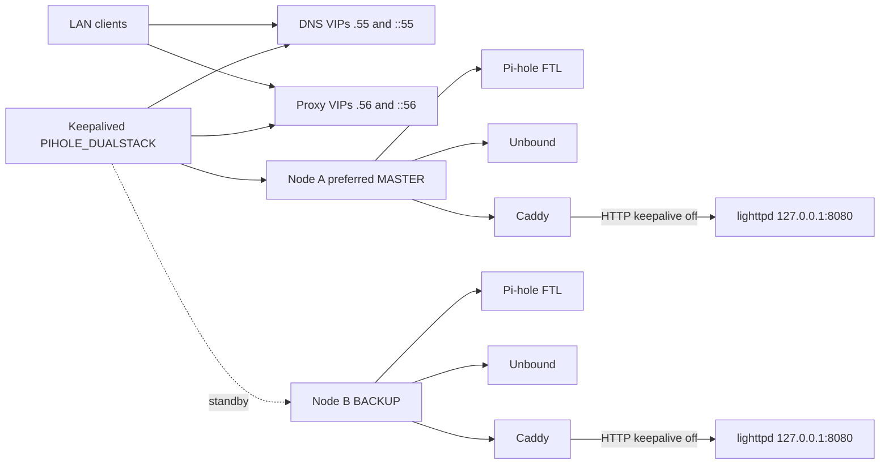
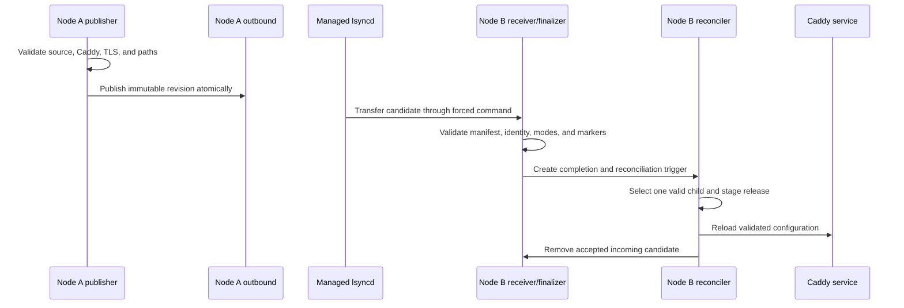
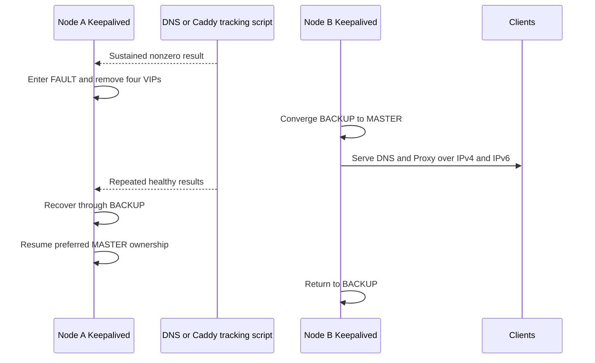
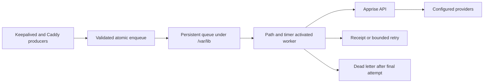

# Caddy HA architecture

This document describes the accepted production system. The governing
decisions and deviations remain in
[`caddy_plan-v1.1.md`](caddy_plan-v1.1.md).

## Ownership boundaries

| Owner | Responsibility |
| --- | --- |
| `homelab-server-configs` | Caddy configuration, protocol-v2 tools, managed lsyncd, Caddy systemd additions, health integration, and durable notification client |
| `homelab-dns` | Keepalived, Pi-hole and Unbound configuration, DNS health, and Keepalived notification producer |
| Pi-hole application | Pi-hole Core, Web, and FTL application state |
| Debian packages | Base Caddy, lighttpd, Keepalived, Unbound, and systemd units |
| `homelab-network` | Routing and firewall policy |
| External systems | TLS secrets, SSH trust, Apprise API, and delivery providers |

The accepted-live manifests identify installed production. Repository source
can move ahead of an accepted installed hash; only a reviewed deployment
operation changes that boundary.

Use [current-live-state.tsv](../manifests/current-live-state.tsv) for accepted
release selection, ownership, and retained publications, and
[HISTORY.md](../HISTORY.md) for acceptance evidence. This is an account of recorded
acceptance, not a claim that documentation detects subsequent live drift.

## Steady state

One Keepalived sync group owns both DNS VIPs and both Proxy VIPs. The Proxy VIPs
remain in `virtual_ipaddress_excluded`; this affects advertisement encoding,
not local ownership. Node A normally owns all four addresses. Node B owns none.

Keepalived tracks node-local DNS and trusted Caddy HTTPS serving health.
Pi-hole/lighttpd backend monitoring reports through notifications and does not
change VRRP eligibility. The monitor reports IPv4 and IPv6 independently and
distinguishes HTTP, TLS, connection, timeout, redirect, and other terminal failures.

## Proxy DNS identity

Pi-hole administration is the current application proxy. Its shared hostname is
`pihole-admin.local.theama.co`; node-specific administration uses each node’s
management hostname and addresses.

The onboarding contract gives each shared reverse-proxied application an A record for `10.1.0.56` and an AAAA
record for `fd36:5aa8:6971:1::56`. Those names are Caddy virtual hosts, not
separate network interfaces or separate reverse-DNS identities. Caddy selects
the application using TLS SNI and the HTTP `Host` header.

The shared Proxy addresses have one canonical reverse identity:

| Address | PTR target |
| --- | --- |
| `10.1.0.56` | `proxy.local.theama.co.` |
| `fd36:5aa8:6971:1::56` | `proxy.local.theama.co.` |

`proxy.local.theama.co` resolves forward to both shared Proxy addresses.
Do not add a PTR for every application hostname. DNS acceptance proves each
application's exact A and AAAA answers, both canonical PTR answers, and the
canonical name's matching forward answers.

## Protocol-v2 publication

Node A publishes normally. Node B requires emergency mode plus MASTER state for
both families and ownership of all four VIPs. The receiver, finalizer, and
reconciler fail closed on malformed, partial, changed, or ambiguous state. An
exact repeat of the active release is validated against the installed payload
and removed from incoming without a Caddy reload. A changed payload under the
same revision is rejected.

This diagram shows peer delivery and activation on Node B. Publication does not
activate the release on Node A. A reviewed operation accepts the standby before
activating the primary through its own finalizer/reconciler. Both nodes now
select the same accepted release. Node A retains its publication; incoming and
quarantine namespaces are empty, and Node B’s outbound namespace is empty.
Consult the live-state manifest for the exact retained revision.

## Coupled failover

The system rejects split-family ownership, partial VIP ownership, simultaneous
ownership, and a settled owner that fails DNS or trusted HTTPS. A lighttpd-only
failure produces a Proxy notification without moving VIPs.

## Durable notifications

Producers acknowledge local enqueue, not remote delivery. The worker owns
network retry, receipts, and dead-letter disposition. Notification failure
cannot affect DNS, Caddy, VRRP, synchronization, or health decisions. See
[`APPRISE_DELIVERY.md`](APPRISE_DELIVERY.md).

## Runtime boundaries

Caddy reads `/etc/caddy/current/Caddyfile`, where `current` selects one
immutable release. Managed lsyncd and reconciliation form the release
control path. They do not affect VIP eligibility. For the sole local Pi-hole
backend, Caddy uses active checks against `/admin/` every 30 seconds with a
3-second timeout, redirect following, and expected HTTP 200. Passive exclusion
is disabled, and `transport http { keepalive off }` opens a fresh upstream
connection for each request. `/healthz` returns 204 without consulting lighttpd
and separately proves the node’s Caddy serving path to Keepalived.

An incorrect password produces Pi-hole’s normal rejection and permits an
immediate allowed retry. Caddy must not replay login POSTs or exclude the sole
backend because authentication was rejected. Active checks can still exclude
an unavailable backend. See
[the authentication contract](caddy_plan-v1.1.md#authentication-availability-contract)
and [Pi-hole login validation](APPLICATION_ONBOARDING.md#pi-hole-login-validation).

The protected node environment supplies only `NODE_FQDN`, `NODE_IPV4`, and
`NODE_IPV6`. Node-specific generated configuration must not cross between
nodes.
